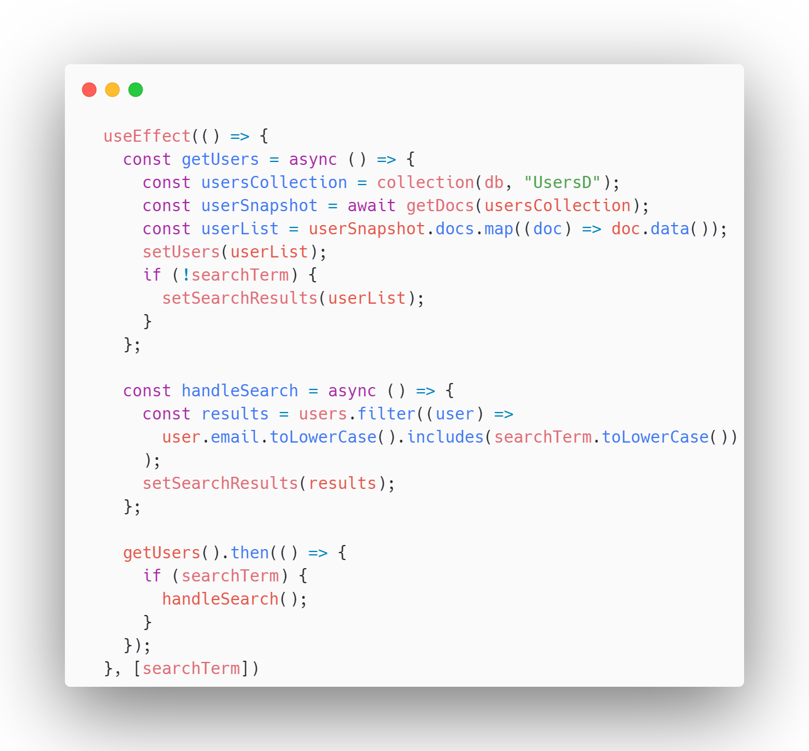

# Arama

getUsers fonksiyonu ile UsersD koleksiyonunda yer alan kullanıcı bilgileri state'e atılır. handleSearch fonksiyonu ile kullanıcılar arasında filreleme yapılarak sonuçlar tekrardan state'e atılır.

<figure><figcaption>
Arama fonksiyonu
</figcaption></figure>
