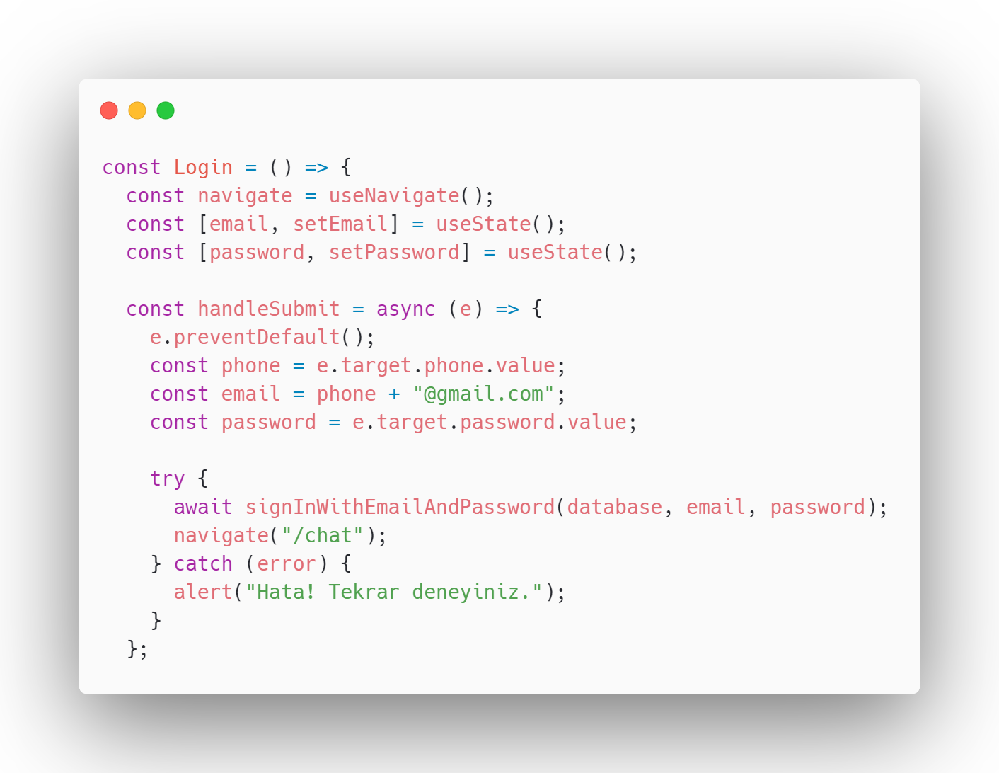

# Giriş

Login fonksiyonunda`signInWithEmailAndPassword` fonksiyonu kullanılarak Firebase Authentication'da kullanıcı giriş yapılır. Eğer giriş başarılı olursa (`navigate("/chat")`) ile kullanıcı "chat" sayfasına yönlendirilir . Giriş sırasında bir hata oluşursa, kullanıcıya hata mesajı gösterilir.

<figure><figcaption>
Login Fonksiyonu
</figcaption></figure>
