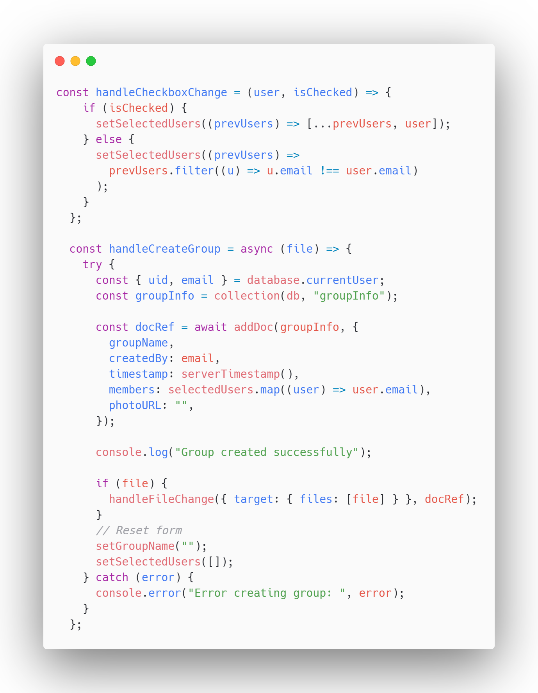

# Gruba Katılımcı Ekleme

handleCheckboxChange fonksiyonu ile checkbox ile katılımcılar seçilir ve seçilen bu kullanıcılar ve ekleyen kullanıcıya ait bilgiler handleCreateGroup fonksiyonu ile Firebase Firestore'a eklenir.

<figure><figcaption>
Katılımcı Ekleme Fonksiyonu
</figcaption></figure>
