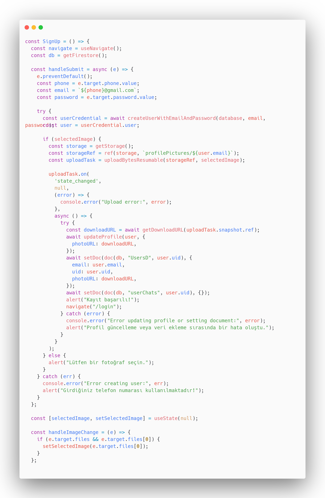

# Kayıt

SignUp fonksiyonu kullanıcıların telefon numaraları ile kayıt olmasını sağlar ve Firebase Authentication, Firestore, ve Storage kullanarak kullanıcı bilgilerini ve profil fotoğraflarını yönetir. Kullanıcı form gönderdiğinde, `createUserWithEmailAndPassword` ile kullanıcı kaydı yapılır ve kullanıcı doğrulandıktan sonra profil resmi Firebase Storage'a yüklenir. Yükleme tamamlandıktan sonra, kullanıcının profil fotoğrafı URL'si ve diğer bilgileri Firestore'da saklanır ve kullanıcı "login" sayfasına yönlendirilir.

<figure><figcaption>
SignUp Fonksiyonu
</figcaption></figure>
